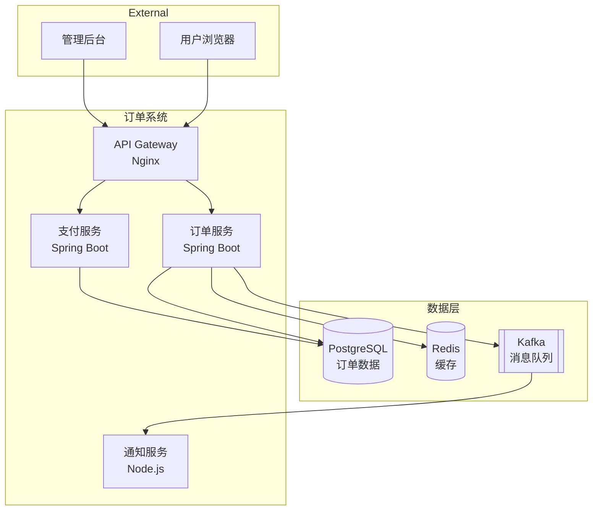
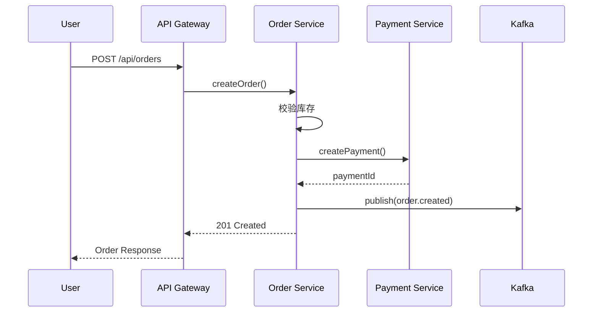

# Tech Writing

## Overview

技术写作工程规范，涵盖文档结构、写作风格、代码示例、图表标准、文档版本管理、API 文档、文档评审、文档即代码。适用于所有技术文档的编写和维护。

---

## Rules

### R01 — 文档结构规范

**MUST** — 技术文档必须根据类型选择对应结构：

- **README**：项目入口，快速了解项目
- **API Guide**：接口使用指南
- **Tutorial**：手把手教程
- **Reference**：详细参考手册

**文档类型与结构：**

| 类型 | 目标读者 | 核心章节 | 篇幅 |
|------|---------|---------|------|
| README | 所有用户 | 简介、快速开始、安装、配置 | < 500 行 |
| API Guide | 开发者 | 认证、接口列表、请求/响应、错误码 | 按模块拆分 |
| Tutorial | 新用户 | 前置条件、步骤、验证、常见问题 | 按场景拆分 |
| Reference | 高级用户 | 完整参数、配置项、返回值、类型 | 按功能拆分 |

✅ Correct:

```markdown
# Project Name

> 一句话描述项目用途

## 快速开始

### 前置条件
- Node.js >= 18
- npm >= 9

### 安装

\`\`\`bash
npm install project-name
\`\`\`

### 基本使用

\`\`\`javascript
import { createClient } from 'project-name';

const client = createClient({
  endpoint: 'https://api.example.com',
  apiKey: process.env.API_KEY
});

const result = await client.query('SELECT * FROM users');
\`\`\`

## 配置

| 参数 | 类型 | 默认值 | 说明 |
|------|------|--------|------|
| endpoint | string | - | API 端点（必填） |
| apiKey | string | - | API 密钥（必填） |
| timeout | number | 30000 | 请求超时（毫秒） |
| retryCount | number | 3 | 重试次数 |

## 更多文档

- [API 文档](./docs/api-guide.md)
- [教程](./docs/tutorial.md)
- [配置参考](./docs/reference.md)

## 许可证

MIT
```

❌ Wrong:

```markdown
# Project

这是一个项目。

## 使用

\`\`\`javascript
// 代码示例
\`\`\`

# ❌ 缺少快速开始
# ❌ 缺少安装步骤
# ❌ 缺少配置说明
# ❌ 缺少许可证
```

**README 必须包含：**

| 章节 | 必须 | 说明 |
|------|------|------|
| 项目简介 | MUST | 一句话说明项目用途 |
| 快速开始 | MUST | 5 分钟内可运行 |
| 安装 | MUST | 明确的安装命令 |
| 配置 | SHOULD | 关键配置项 |
| 贡献指南 | SHOULD | 如何参与贡献 |
| 许可证 | MUST | 开源协议 |

---

### R02 — 写作风格规范

**MUST** — 技术文档写作必须遵循以下规则：

- 使用清晰、简洁、主动语态
- 一个段落只表达一个主题
- 句子长度控制在 30 字以内
- 避免模糊词汇（如"可能"、"大概"、"一些"）

**写作原则：**

| 原则 | 说明 | 示例 |
|------|------|------|
| 主动语态 | 主语执行动作 | "系统返回错误"而非"错误被返回" |
| 简洁表达 | 删除冗余词汇 | "点击提交"而非"请点击提交按钮" |
| 具体描述 | 避免模糊词汇 | "3 秒后重试"而非"稍后重试" |
| 一致术语 | 同一概念同一用词 | 全文统一"请求"或"Request" |

✅ Correct:

```markdown
## 错误处理

当 API 请求失败时，系统返回 HTTP 4xx 或 5xx 状态码。

响应体包含以下字段：

| 字段 | 类型 | 说明 |
|------|------|------|
| code | integer | 业务错误码 |
| message | string | 错误描述 |
| details | array | 详细错误信息 |

常见错误码：

| 错误码 | HTTP 状态码 | 说明 | 处理方式 |
|--------|-----------|------|---------|
| 40001 | 400 | 参数校验失败 | 检查请求参数 |
| 40101 | 401 | Token 过期 | 刷新 Token |
| 40301 | 403 | 权限不足 | 联系管理员 |
| 42901 | 429 | 请求频率超限 | 降低请求频率 |
| 50001 | 500 | 服务内部错误 | 联系技术支持 |
```

❌ Wrong:

```markdown
## 错误处理

有时候 API 可能会返回一些错误，大概是因为各种原因导致的。如果遇到错误的话，可以尝试重新请求一下，或者联系相关人员看看是什么问题。

# ❌ 使用模糊词汇（"有时候"、"大概"、"一些"、"相关人员"）
# ❌ 没有具体错误码
# ❌ 没有处理方式
```

**术语表：**

| 推荐用词 | 避免用词 | 说明 |
|---------|---------|------|
| 点击 | 单击 / 按下 | 统一使用"点击" |
| 设置 | 配置 / 设定 | 统一使用"设置" |
| 目录 | 文件夹 | 技术文档使用"目录" |
| 运行 | 执行 / 跑 | 统一使用"运行" |
| 返回 | 响应 / 回复 | API 语境使用"返回" |

**中英文混排规则：**

- 中文与英文/数字之间加空格
- 英文标点与中文标点不混用
- 技术术语保留英文原文

```markdown
✅ 正确：使用 Node.js 18 版本，配置 API Key 后运行 npm start。

❌ 错误：使用node.js18版本，配置apikey后运行npm start。
```

---

### R03 — 代码示例规范

**MUST** — 文档中的代码示例必须遵循以下规则：

- 代码示例必须可运行、可测试
- 必须标注语言类型
- 必须包含必要的 import 语句
- 必须提供预期输出
- 禁止使用伪代码（除非明确标注）

**代码示例模板：**

✅ Correct:

````markdown
## 创建用户

使用以下代码创建新用户：

```python
from client import APIClient

client = APIClient(
    endpoint="https://api.example.com",
    api_key="your-api-key"
)

user = client.users.create(
    name="Alice",
    email="alice@example.com",
    role="admin"
)

print(user)
```

预期输出：

```json
{
  "id": "usr_abc123",
  "name": "Alice",
  "email": "alice@example.com",
  "role": "admin",
  "created_at": "2024-01-15T10:30:00Z"
}
```
````

❌ Wrong:

````markdown
## 创建用户

```python
# 伪代码
user = api.create(name, email, role)
```

# ❌ 缺少 import
# ❌ 参数没有具体值
# ❌ 没有预期输出
# ❌ 使用伪代码但未标注
````

**代码示例检查清单：**

| 检查项 | 说明 |
|--------|------|
| 可运行 | 复制粘贴即可运行 |
| 有 import | 包含所有必要的导入 |
| 有参数值 | 使用具体值而非占位符 |
| 有输出 | 展示预期返回结果 |
| 有错误处理 | 展示常见错误场景 |
| 语言标注 | 代码块标注语言类型 |

**多语言示例：**

````markdown
### 创建用户

=== "Python"

    ```python
    from client import APIClient

    client = APIClient(endpoint="https://api.example.com")
    user = client.users.create(name="Alice", email="alice@example.com")
    ```

=== "JavaScript"

    ```javascript
    import { APIClient } from 'client';

    const client = new APIClient({ endpoint: 'https://api.example.com' });
    const user = await client.users.create({
      name: 'Alice',
      email: 'alice@example.com'
    });
    ```

=== "cURL"

    ```bash
    curl -X POST https://api.example.com/users \
      -H "Authorization: Bearer ${API_KEY}" \
      -H "Content-Type: application/json" \
      -d '{"name": "Alice", "email": "alice@example.com"}'
    ```
````

---

### R04 — 图表标准

**MUST** — 文档中的图表必须遵循以下规则：

- 架构图使用 C4 Model
- 交互流程使用 Sequence Diagram
- 业务流程使用 Flowchart
- 图表必须有标题和编号
- 图表使用文本描述格式（Mermaid / PlantUML）

**图表类型选择：**

| 场景 | 图表类型 | 工具 |
|------|---------|------|
| 系统架构 | C4 Model | Mermaid / PlantUML / Draw.io |
| 服务交互 | Sequence Diagram | Mermaid |
| 业务流程 | Flowchart | Mermaid |
| 状态转换 | State Diagram | Mermaid |
| 数据关系 | ER Diagram | Mermaid / DBML |

✅ Correct:

```markdown
### 图 1: 系统架构图（C4 - Container Level）



### 图 2: 下单流程（Sequence Diagram）


```

❌ Wrong:

```markdown
# ❌ 使用截图而非文本描述


# ❌ 图表没有标题和编号
# ❌ 无法版本化管理
# ❌ 无法 diff 变更
```

**C4 Model 层级：**

| 层级 | 名称 | 关注点 | 示例 |
|------|------|--------|------|
| Level 1 | Context | 系统与外部交互 | 用户 → 订单系统 → 支付网关 |
| Level 2 | Container | 系统内部容器 | API Gateway → 订单服务 → 数据库 |
| Level 3 | Component | 容器内部组件 | OrderController → OrderService → OrderRepository |
| Level 4 | Code | 类级别细节 | 单个类的结构 |

---

### R05 — 文档版本管理

**MUST** — 文档版本管理必须遵循以下规则：

- 文档必须与代码在同一仓库管理
- 文档变更必须有对应的 Commit Message
- API 文档必须标注适用的版本范围
- 重大变更必须有迁移指南

**版本标注规范：**

✅ Correct:

```markdown
# API 文档

> 适用版本：v2.0.0+
> 最后更新：2024-01-15
> 维护者：后端团队

## 版本历史

| 版本 | 日期 | 变更内容 | 作者 |
|------|------|---------|------|
| v2.1.0 | 2024-01-15 | 新增批量查询接口 | 张三 |
| v2.0.0 | 2023-12-01 | API v2 发布，不兼容 v1 | 李四 |
| v1.5.0 | 2023-10-15 | 新增分页参数 | 王五 |

## v1 → v2 迁移指南

### Breaking Changes

1. 认证方式从 API Key 变更为 Bearer Token
2. 响应格式从 `{ code, data }` 变更为 `{ code, message, data }`
3. 分页参数从 `page/size` 变更为 `offset/limit`

### 迁移步骤

1. 更新认证方式
   ```python
   # v1
   client = APIClient(api_key="xxx")

   # v2
   client = APIClient(bearer_token="xxx")
   ```

2. 更新响应处理
   ```python
   # v1
   result = client.get("/users")
   data = result["data"]

   # v2
   result = client.get("/users")
   if result["code"] != 0:
       raise APIError(result["message"])
   data = result["data"]
   ```
```

❌ Wrong:

```markdown
# API 文档

## 接口列表
...

# ❌ 没有版本信息
# ❌ 没有变更记录
# ❌ Breaking Changes 没有迁移指南
```

**文档与代码同步策略：**

| 策略 | 说明 | 适用场景 |
|------|------|---------|
| 代码即文档 | 从代码注释自动生成 | API Reference |
| 文档驱动 | 先写文档再写代码 | API Design |
| 混合模式 | 核心文档手写，API 自动生成 | 大多数项目 |

---

### R06 — API 文档规范

**MUST** — API 文档必须遵循以下规则：

- 使用 OpenAPI 3.0 / Swagger 规范
- 每个接口必须有 Summary 和 Description
- 必须包含请求示例和响应示例
- 必须定义所有错误码
- 必须标注认证要求

**OpenAPI 文档结构：**

✅ Correct:

```yaml
openapi: 3.0.3
info:
  title: Order Service API
  version: 2.1.0
  description: |
    订单服务 API 文档。

    ## 认证方式
    所有接口使用 Bearer Token 认证，在请求头中添加：
    ```
    Authorization: Bearer <token>
    ```

    ## 速率限制
    - 标准计划：100 请求/分钟
    - 企业计划：1000 请求/分钟

    ## 错误处理
    所有错误响应遵循统一格式：
    ```json
    {
      "code": 40001,
      "message": "参数校验失败",
      "details": ["name 不能为空"]
    }
    ```

servers:
  - url: https://api.example.com/v2
    description: 生产环境
  - url: https://api-staging.example.com/v2
    description: 预发环境

security:
  - BearerAuth: []

paths:
  /orders:
    get:
      summary: 查询订单列表
      description: |
        分页查询订单列表，支持按状态、时间范围过滤。

        **权限要求**：`order:read`
      operationId: listOrders
      tags: [Orders]
      parameters:
        - name: status
          in: query
          schema:
            type: string
            enum: [pending, paid, shipped, completed, cancelled]
          description: 订单状态过滤
        - name: offset
          in: query
          schema:
            type: integer
            default: 0
            minimum: 0
          description: 分页偏移量
        - name: limit
          in: query
          schema:
            type: integer
            default: 20
            maximum: 100
          description: 每页数量
      responses:
        '200':
          description: 查询成功
          content:
            application/json:
              schema:
                $ref: '#/components/schemas/OrderListResponse'
        '401':
          $ref: '#/components/responses/Unauthorized'

components:
  securitySchemes:
    BearerAuth:
      type: http
      scheme: bearer
      bearerFormat: JWT

  responses:
    Unauthorized:
      description: 认证失败
      content:
        application/json:
          schema:
            $ref: '#/components/schemas/ErrorResponse'
          example:
            code: 40101
            message: "Token 已过期"
```

❌ Wrong:

```yaml
# ❌ 缺少认证说明
# ❌ 缺少速率限制说明
# ❌ 缺少错误码定义
# ❌ 缺少请求/响应示例
paths:
  /orders:
    get:
      summary: 获取订单
      responses:
        200:
          description: OK
```

**API 文档自动生成：**

| 框架 | 工具 | 说明 |
|------|------|------|
| Spring Boot | SpringDoc / Swagger | 注解驱动 |
| FastAPI | 内置 OpenAPI | 自动生成 |
| Express | swagger-jsdoc | JSDoc 注解 |
| Go | Swag | 注释驱动 |

---

### R07 — 文档评审

**MUST** — 文档评审必须遵循以下规则：

- 文档变更必须经过评审
- 评审关注准确性、完整性、可读性
- 评审意见必须记录并处理
- 重大文档变更需要多人评审

**评审检查清单：**

| 维度 | 检查项 | 说明 |
|------|--------|------|
| 准确性 | 技术描述正确 | 与实际实现一致 |
| 准确性 | 代码示例可运行 | 复制粘贴即可运行 |
| 准确性 | 版本信息准确 | 适用的版本范围正确 |
| 完整性 | 覆盖所有功能 | 无遗漏的接口或配置 |
| 完整性 | 包含错误处理 | 异常场景有说明 |
| 完整性 | 包含前置条件 | 依赖和前提明确 |
| 可读性 | 结构清晰 | 层级分明，易于导航 |
| 可读性 | 语言简洁 | 无冗余表述 |
| 可读性 | 术语一致 | 同一概念同一用词 |

✅ Correct:

```markdown
## 文档评审记录

### 评审信息
- **文档**: API Guide v2.1
- **日期**: 2024-01-15
- **评审人**: 张三（技术）、李四（产品）、王五（技术写作）

### 评审意见

| 编号 | 维度 | 意见 | 处理结果 | 状态 |
|------|------|------|---------|------|
| 1 | 准确性 | 分页参数描述与实际不一致 | 已修正为 offset/limit | 已解决 |
| 2 | 完整性 | 缺少批量删除接口文档 | 已补充 | 已解决 |
| 3 | 可读性 | 错误码表格缺少处理建议 | 已添加处理方式列 | 已解决 |
| 4 | 准确性 | Python 示例缺少 import | 已补充 | 已解决 |

### 评审结论
- [x] 通过
- [ ] 需修订后再次评审
```

❌ Wrong:

```markdown
# ❌ 文档未经评审直接发布
# ❌ 评审意见未记录
# ❌ 发现的问题未跟踪处理
```

**评审流程：**

```
文档初稿
    ↓
自我检查（作者）
    ↓
同行评审（1-2 人）
    ↓
修订文档
    ↓
最终确认
    ↓
发布
```

---

### R08 — 文档即代码

**MUST** — 文档即代码（Docs as Code）必须遵循以下规则：

- 文档使用 Markdown 格式编写
- 文档存储在 Git 仓库中，与代码同版本管理
- 文档变更遵循与代码相同的 Review 流程
- 文档构建和发布自动化

**目录结构：**

```
project/
├── docs/                          # 文档目录
│   ├── README.md                  # 文档首页
│   ├── getting-started.md         # 快速开始
│   ├── api-guide.md               # API 指南
│   ├── tutorial.md                # 教程
│   ├── reference.md               # 参考手册
│   ├── migration/                 # 迁移指南
│   │   ├── v1-to-v2.md
│   │   └── v2-to-v3.md
│   └── changelog.md               # 变更日志
├── api/                           # OpenAPI 定义
│   └── openapi.yaml
├── src/                           # 源代码
└── .github/
    └── workflows/
        └── docs.yml               # 文档构建 CI
```

**CI/CD 自动化：**

✅ Correct:

```yaml
# .github/workflows/docs.yml
name: Docs CI

on:
  push:
    paths:
      - 'docs/**'
      - 'api/**'
  pull_request:
    paths:
      - 'docs/**'
      - 'api/**'

jobs:
  lint:
    runs-on: ubuntu-latest
    steps:
      - uses: actions/checkout@v4
      - name: Markdown Lint
        uses: DavidAnson/markdownlint-cli2-action@v14
        with:
          globs: 'docs/**/*.md'

      - name: Check Links
        uses: lycheeverse/lychee-action@v1
        with:
          args: 'docs/**/*.md'

      - name: Spell Check
        uses: streets-of-code/markdown-spellcheck-action@v2
        with:
          config-file: .spellcheck.yml

  build:
    needs: lint
    runs-on: ubuntu-latest
    steps:
      - uses: actions/checkout@v4
      - name: Build Docs
        run: |
          pip install mkdocs-material
          mkdocs build

      - name: Deploy
        if: github.ref == 'refs/heads/main'
        run: mkdocs gh-deploy --force
```

❌ Wrong:

```yaml
# ❌ 文档没有 CI/CD
# ❌ 没有链接检查
# ❌ 没有拼写检查
# ❌ 手动部署
```

**Markdown 规范：**

| 规则 | 说明 | 示例 |
|------|------|------|
| 标题层级 | 不跳级 | H1 → H2 → H3 |
| 代码块 | 标注语言 | ` ```python ` |
| 链接 | 使用相对路径 | `[API](./api-guide.md)` |
| 图片 | 使用相对路径 | `` |
| 表格 | 对齐列 | 使用 `|` 分隔 |
| 列表 | 一致风格 | 统一使用 `-` |

**文档构建工具：**

| 工具 | 特点 | 适用场景 |
|------|------|---------|
| MkDocs | Markdown → 静态站点 | 项目文档 |
| Docusaurus | React 驱动 | 开源项目文档 |
| Sphinx | reStructuredText | Python 项目 |
| VitePress | Vue 驱动 | 前端项目 |
| Swagger UI | OpenAPI 渲染 | API 文档 |

---

## Checklist

- [ ] 文档根据类型选择对应结构（README/API Guide/Tutorial/Reference）
- [ ] README 包含项目简介、快速开始、安装、配置、许可证
- [ ] 写作风格清晰简洁，使用主动语态
- [ ] 避免模糊词汇，使用具体描述
- [ ] 中英文混排遵循空格规则，技术术语保留英文
- [ ] 代码示例可运行、可测试，包含 import 和预期输出
- [ ] 代码块标注语言类型，禁止未标注的伪代码
- [ ] 多语言示例使用 Tab 切换展示
- [ ] 架构图使用 C4 Model，交互流程使用 Sequence Diagram
- [ ] 图表使用文本描述格式（Mermaid/PlantUML），有标题和编号
- [ ] 文档与代码在同一仓库管理
- [ ] API 文档标注适用版本范围，重大变更有迁移指南
- [ ] API 文档使用 OpenAPI 3.0 规范
- [ ] API 文档包含认证说明、速率限制、错误码
- [ ] 文档变更经过评审，评审意见记录并处理
- [ ] 文档使用 Markdown 格式，存储在 Git 仓库
- [ ] 文档构建和发布自动化（CI/CD）
- [ ] 配置 Markdown Lint、链接检查、拼写检查
